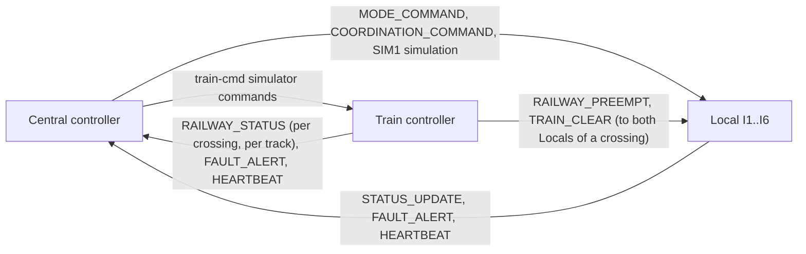

# Traffic Light Real-Time System

A distributed, real-time traffic control system for **QNX Neutrino 7.1**. Six road
intersections (I1–I6) run their own traffic lights, a railway line with three level
crossings (P1–P3) runs boom gates and simulated trains, and a central control room
supervises everything. The three subsystems are separate programs that talk to each
other with QNX message passing, on one VM or across three VMs.

- [System overview](#system-overview)
- [Repository layout](#repository-layout)
- [How the controllers communicate](#how-the-controllers-communicate)
- [Build](#build)
- [Run](#run)
- [Using each controller](#using-each-controller)
- [Behaviour](#behaviour)
- [Configuration](#configuration)
- [Testing](#testing)
- [Known limitations](#known-limitations)
- [Further documentation](#further-documentation)

---

## System overview

```text
            I1                         I3                         I5
      +-------------+            +-------------+            +-------------+
      | Local I1    |            | Local I3    |            | Local I5    |
      +------+------+            +------+------+            +------+------+
             |                          |                          |
   ==========P1=========================P2=========================P3==========   railway
     <<< UP  (train runs P3 -> P2 -> P1)          DN >>>  (train runs P1 -> P2 -> P3)
   ===========================================================================
             |                          |                          |
      +------+------+            +------+------+            +------+------+
      | Local I2    |            | Local I4    |            | Local I6    |
      +-------------+            +-------------+            +-------------+
            I2                         I4                         I6
```

Each crossing affects the two intersections beside it: **P1 → I1, I2**,
**P2 → I3, I4**, **P3 → I5, I6**.

| Subsystem | Program | Owns | Does not do |
|---|---|---|---|
| **Local intersection controller** (×6) | `local_intersection_controller` | Vehicle lights, pedestrian WALK/STOP, vehicle sensors, fixed/sensor timing, holding red while a train is near | Never commands gates or other intersections |
| **Train / railway controller** | `train_controller` | Train simulation on two tracks, boom gates, road flashing lights, train signal, gate fault detection | Never commands traffic lights |
| **Central controller** | `central_controller` + `central_ui` | Monitoring all status, fault log, operator requests (modes, coordination, simulation, train tests), live map | Never sets an individual lamp or gate directly |

Safety decisions stay in the subsystem that owns the equipment. Locals and Train keep
running safely if Central or a network link is lost.

---

## Repository layout

```text
common/                          Shared by all controllers
  protocol.h                     Message types, payload structs, timing constants
  common.h                       Service names, VM names, helpers
  communication/                 Connect / send (with timeouts) / receive helpers

local_intersection_controller/   Local controller (one binary, several process roles)
  src/                           core, comm, io, display, ui, launcher, traffic, pedestrian ...
  start_locals.sh                Start six core + comm pairs
  PROCESSES.md                   Process roles, UI, timing contract, acceptance checks
  tests/                         Timing and input tests

train_controller/                Railway controller
  src/train_controller.c         Threads, IPC to Central and the six Locals
  src/crossing/crossing.c        Crossing state machine (tracks, gate, faults)
  src/crossing/rail_sim.c        Train and gate simulator, console commands
  src/crossing/crossing_config.h Timing and track-layout settings
  src/ui/                        Train console screens

central_controller/              Central control room
  src/central_controller.c       Core: monitoring, command queues, dashboard, live map
  src/central_ui.c               Separate display / operator terminal
  src/commands.c, operator_policy.c, monitor.c, ipc.c, ui_ipc.c
  config/daily_schedule.example  Optional time-of-day schedule
  README.md, INTEGRATION.md, IMPLEMENTATION_NOTE.md, VALIDATION.md
  tests/                         Parser, monitor, IPC, integration and real-Train tests

info/train_info.txt              Railway subsystem design notes
guide_run.txt                    Older plain-text run guide
```

---

## How the controllers communicate

All controllers use QNX message passing (`name_attach` / `name_open` / `MsgSend`).
Every message is a `msg_header_t` (type, source, destination, timestamp) followed by
a payload defined in [`common/protocol.h`](common/protocol.h).



| Message | From → To | Purpose |
|---|---|---|
| `MSG_STATUS_UPDATE` | Local → Central | Lights, phase, mode, pedestrians, sensors, train hold, faults, simulated time |
| `MSG_FAULT_ALERT` | Local / Train → Central | Lamp, sensor, link or gate fault |
| `MSG_HEARTBEAT` | Local / Train ↔ Central | Link health (3 missed = link down) |
| `MSG_MODE_COMMAND` | Central → Local | Fixed / sensor mode, temporary mode, revert |
| `MSG_COORDINATION_COMMAND` | Central → Local | Fixed-cycle phase and offset |
| `MSG_RAILWAY_PREEMPT` | Train → Local | Train approaching the crossing, with ETA |
| `MSG_TRAIN_CLEAR` | Train → Local | Crossing clear, gate open |
| `MSG_RAILWAY_STATUS` | Train → Central | Gate state, fault, train state for each track (UP/DN) |
| `MSG_TEST` | Central → Local / Train | `SIM1` simulation requests and Train simulator commands |

Every send waits at most about 500 ms for a reply, so a missing peer cannot block a
controller.

### Service names

| Service | Published by |
|---|---|
| `traffic_central_controller` | Central |
| `traffic_central_controller_ui` | Central (private, for `central_ui`, same node only) |
| `traffic_train_controller` | Train |
| `traffic_local_I1` … `traffic_local_I6` | Local comm process for each intersection |
| `traffic_local_I#_core` | Local core process (private, same node only) |

Train also accepts the legacy name `traffic_local_controller` for I1.

### Single VM (`-l`) and multi-VM (`-g`)

- **`-l` (single VM):** controllers find each other under `/dev/name/local/`.
- **`-g` (three VMs):** every controller still registers locally, and peers are
  reached over **Qnet** at `/net/<vm-name>/dev/name/local/<service>`. The VM names are
  fixed in [`common/common.h`](common/common.h), so each VM's Qnet node name must match:

  | VM | Qnet node name | Runs |
  |---|---|---|
  | VM1 | `vm1_local_intersection` | The six Local controllers |
  | VM2 | `vm2_train_controller` | Train controller |
  | VM3 | `vm3_central_controller` | Central controller and `central_ui` |

  Check Qnet from any VM with `ls /net` — all three node names should be listed.

---

## Build

In a shell configured for **QNX SDP 7.1** (or from Momentics), from the repository root:

```sh
make -C local_intersection_controller all PLATFORM=x86_64
make -C train_controller all PLATFORM=x86_64
make -C central_controller all PLATFORM=x86_64   # builds central_controller and central_ui
```

Binaries are written to `<component>/build/x86_64-debug/`. Add
`BUILD_PROFILE=release` for optimised builds. Copy these to the QNX target(s), for
example to `/tmp`:

```text
local_intersection_controller/build/x86_64-debug/local_intersection_controller
train_controller/build/x86_64-debug/train_controller
central_controller/build/x86_64-debug/central_controller
central_controller/build/x86_64-debug/central_ui
```

> The controllers share message formats in `common/protocol.h`. After pulling changes
> to `common/`, rebuild **all** controllers and copy all binaries together.

---

## Run

### Single VM (quick start)

Use one terminal per program:

```sh
# Terminal 1 - Central core (keeps running without a screen)
/tmp/central_controller -l --headless

# Terminal 2 - Central display and operator input
/tmp/central_ui

# Terminal 3 - all six Local intersections (six core + six comm processes and the UI)
/tmp/local_intersection_controller -l

# Terminal 4 - Train controller
/tmp/train_controller -l
```

Central finds `traffic_local_I1` … `I6` by default, so no endpoint options are needed
with the standard names. Omit Central's `--schedule` so each Local's simulated clock
controls time-of-day behaviour.

### Multi-VM

Make sure Qnet is running and the node names match the table above, then:

```sh
# VM3 - Central
/tmp/central_controller -g --headless
/tmp/central_ui                            # second terminal on VM3

# VM1 - Locals
/tmp/local_intersection_controller -g

# VM2 - Train
/tmp/train_controller -g
```

### Quick checks

1. In `central_ui`, type `S` (status): I1–I6 and P1–P3 show as connected and current.
2. Type `SA` (sensor mode for all): every Local switches mode.
3. Type `TB` (train both ways): P1–P3 gates close and reopen, affected intersections
   hold red, and both trains move along the live map (`L`).
4. Stop the Train controller: Central marks the railway link lost; Locals keep running.

---

## Using each controller

### Central — `central_ui`

`central_ui` is a separate screen for the Central core. Closing it (`quit` or `0`)
leaves Central running; `shutdown` stops the core. It must run on the same node as
`central_controller`. Without `--headless`, `central_controller` has its own built-in
console instead.

**Shortcuts**

| Key | Action |
|---|---|
| `L` / `watch` | Live dashboard with traffic map and railway lanes (Enter stops) |
| `S` / `E` / `F` / `C` | Status snapshot / recent events / active faults / command history |
| `F1`–`F6`, `FA` | Fixed mode for one / all intersections |
| `S1`–`S6`, `SA` | Sensor mode for one / all intersections |
| `A1`–`A6`, `AA` | Start Local traffic simulation |
| `X1`–`X6`, `XA` | Stop Local traffic simulation |
| `TU` / `TD` / `TB` / `TS` | Train UP / DOWN / both / Train status |
| `M` / `H` / `0` | Menu / full help / quit display |

**Commands** (any of these can also be typed, or sent once with `central_ui -c '<command>'`)

| Command | Purpose |
|---|---|
| `mode-fixed [I1..I6\|all]`, `mode-sensor [I1..I6\|all]` | Request a traffic mode |
| `mode-temp I1 sensor 30`, `mode-revert I1` | Temporary mode for N seconds / cancel it |
| `coordinate I1 NS 0` | Fixed-cycle coordination: phase and offset 0–63 s |
| `coordinate-at 10 all NS 3` | Dispatch coordination after 1–3600 s |
| `sim-start I1`, `sim-stop I1`, `sim-time I1 07:00` | Local traffic simulation and simulated clock |
| `train-cmd train-up` / `train-down` / `train-both` | Run a train along the whole line |
| `train-cmd train P1 up`, `train-cmd noexit P2 down` | One-crossing train / train that never leaves |
| `train-cmd stuck P3`, `train-cmd reset P3` | Stick a gate / reset a crossing fault |
| `train-cmd scale 5`, `train-cmd status` | Simulator time scale 1–100 / simulator status |
| `status`, `commands`, `faults`, `events` | Reports, command outcomes, fault log, events |
| `schedule`, `schedule-resume I1`, `version`, `help` | Schedule, release operator hold, build, help |

A command outcome of `ACCEPTED` means the peer received it; check status to confirm it
was applied. Central options: `-l`/`-g`, `--headless`, `-s 1..60` (maximum status age,
default 5 s), `-o <log>` (default `/tmp/central_controller.log`),
`--schedule <file>`, `--local-endpoint I#=<service>`.

**Live railway map.** Each lane shows what Train reports for that track: a train is
drawn just before a crossing it is approaching, on a crossing it occupies, and between
crossings after it leaves one until the next crossing reports. UP trains
`<[<<<][<<<]` run right to left and DN trains `[>>>][>>>]>` run left to right.

### Local intersections

`/tmp/local_intersection_controller -l` (or `-g`) starts all six intersections and an
interactive UI. The UI starts in the all-intersections view:

| Input | Action |
|---|---|
| `view I3` / `view all` | Select one intersection / overview |
| `m` | Switch fixed ↔ sensor mode (manual override) |
| `n` / `e` | Pedestrian request North-South / East-West |
| `x` / `z` | Toggle NS / EW vehicle sensor |
| `1` / `2` / `c` | Local train test on line 1 / line 2 / clear |
| `p` / `o` / `l` | Simulated time: peak 07:00 / off-peak 12:00 / night 22:00 |
| `r` | Reset demo inputs |
| `q` | Quit the launcher (stops the processes it started) |

Control commands apply to the selected intersection only. Each intersection can also
be run as separate processes (`--role core|comm|io|display|ui`, `-i I1..I6`,
`-n <service>`) or with `sh local_intersection_controller/start_locals.sh -l`; see
[PROCESSES.md](local_intersection_controller/PROCESSES.md).

### Train controller

`/tmp/train_controller -l` (or `-g`) opens a menu: **1** status screen, **2** command
screen, **3** exit. On the status screen each crossing shows both tracks, gate, road
flashing lights, fault and the last PREEMPT/CLEAR times. Commands on the command screen:

| Command | Action |
|---|---|
| `train-up` / `train-down` / `train-both` | Train along the line (UP P3→P2→P1, DOWN P1→P2→P3) |
| `train P1 up` | Train at one crossing (`up` or `down`) |
| `noexit P2 down` | Train that never leaves (raises a train timeout fault) |
| `stuck P3` / `p1-fault` / `reset P1` | Stuck gate / inject fault / reset fault and unstick |
| `scale N` | Simulation speed 1–100 (default ×10) |
| `status` / `help` | Simulator status and track layout / all commands |
| `send-central` / `send-local` | Connection test messages |

UP and DOWN trains can run at the same time; a second train on the same track at the
same crossing is refused with `BUSY`.

---

## Behaviour

### Traffic lights (Local)

- **Fixed mode:** NS Green 20 s → Yellow 2 s → EW Green 20 s → Yellow 2 s, a **44 s**
  cycle. The six intersections start staggered (I1, I4, I5 on EW; I2, I3, I6 on NS).
- **Sensor mode:** with 5 or more cars waiting on one approach, that Green gets +5 s
  and the other −5 s (for example 25/15). Green always stays between 10 and 30 s.
- **Pedestrians:** WALK starts 1 s after a compatible Green and ends 5 s before
  Yellow. A button press can shorten the current Green and give the time to the next.
- **Railway pre-emption:** on `RAILWAY_PREEMPT` the Local holds the railway-feeding
  movement red; after `TRAIN_CLEAR` it holds red another 2 s, then restarts its cycle.
- **Time of day:** the Local's simulated clock selects peak / off-peak / night
  behaviour.

### Railway crossings (Train)

Each crossing has two tracks (UP, DOWN), one boom gate, road flashing lights and a
train signal. For every train, at every crossing on its route:

1. **Warning** (default 10 s before arrival): track → APPROACHING, flashing lights on,
   `RAILWAY_PREEMPT` sent to both affected Locals.
2. After 5 s the gate starts closing and is closed 3 s later, before the train arrives.
3. **Arrival:** track → ON_CROSSING.
4. **Exit** (after the train length): the gate opens only when **both** tracks are
   clear. When it is fully open the lights go off and `TRAIN_CLEAR` is sent.
5. If another train approaches while the gate is opening, the gate closes again and no
   CLEAR is sent.

**Faults:** gate close/open taking over 10 s, a train entering before the gate is
closed, a train on the crossing for over 60 s, or an injected fault. On a fault the
gate is marked FAULT, flashing lights stay on, the train signal turns STOP and a
`FAULT_ALERT` goes to Central. `reset P#` re-checks the gate (close then open) and
returns the crossing to service.

### Central supervision

- Status older than 5 s (configurable with `-s`) is shown as stale, and commands to
  that intersection are held back until fresh status arrives.
- Three missed heartbeats mark a link lost. Old data stays visible, marked
  OFFLINE / WAITING UPDATE / STALE.
- Requests are queued per endpoint and never automatically resent after a timeout;
  the outcome is recorded as ACCEPTED, REJECTED or UNCONFIRMED.
- An optional daily schedule (`--schedule`) sets modes by wall-clock time; operator
  commands take priority.

---

## Configuration

**Train timing and track layout** — [`train_controller/src/crossing/crossing_config.h`](train_controller/src/crossing/crossing_config.h),
compile-time; rebuild `train_controller` after changes:

| Setting | Meaning | Allowed | Default |
|---|---|---|---|
| `DISTANCE_P1_P2_UNITS` | Travel time P1↔P2 (front to front), 1 unit = 5 s | 1–5 | 2 |
| `DISTANCE_P2_P3_UNITS` | Travel time P2↔P3 | 1–5 | 2 |
| `TRAIN_LENGTH_SEC` | Seconds a train occupies a crossing | 1–59 | 5 |
| `TRAIN_WARNING_SEC` | Seconds before arrival that PREEMPT is sent | 10–120 | 10 |
| `DEFAULT_TIME_SCALE` | Simulation speed | — | 10 |

A value outside its range is refused at startup and the default is used; the Train
controller prints the reason. `status` on the Train console shows the layout in use.
A train longer than the distance to the next crossing is still on one crossing when the
next crossing receives its warning.

**Shared timing** — [`common/protocol.h`](common/protocol.h): green base/min/max,
yellow, pedestrian WALK window, sensor threshold and adjustment, heartbeat period,
railway recovery time.

**Local demo switches** — `ENABLE_DEMO_COMMANDS` and `ENABLE_TRAFFIC_SIMULATION` in
[`local_controller.h`](local_intersection_controller/src/local_controller.h).

**Central schedule** — copy
[`config/daily_schedule.example`](central_controller/config/daily_schedule.example);
each line is `HH:MM fixed|sensor I1..I6|all`.

---

## Testing

```sh
# Central: build on the host, run on QNX
make -C central_controller/tests all PLATFORM=x86_64
./commands_test && ./monitor_test && ./ipc_test && ./operator_policy_test && ./ui_ipc_test
./integration_test ./central_fixture
./central_features_test ./central_fixture
./real_train_test ./central_fixture ./real_train_fixture

# Local: timing, pedestrian and railway recovery tests on QNX
make -C local_intersection_controller/tests run PLATFORM=x86_64
```

Run the fixture suites one at a time (they share test service names). The Train
crossing logic has built-in requirement tests in
[`crossing_test.c`](train_controller/src/crossing/crossing_test.c). Recorded results
and limits are in [central_controller/VALIDATION.md](central_controller/VALIDATION.md)
and [local_intersection_controller/VALIDATION.md](local_intersection_controller/VALIDATION.md).

---

## Known limitations

- End-to-end response times, jitter and deadlines have not been measured on QNX; send
  timeouts bound waiting but do not prove schedulability.
- `ACCEPTED` confirms receipt only. The Train controller replies success even when its
  simulator refuses a command (for example `BUSY`).
- Central refuses to send `p#-fault` remotely; inject faults from the Train console, or
  use `train-cmd stuck P#` followed by a train.
- Train commands from Central need the `train-cmd` prefix (or the `TU`/`TD`/`TB` keys).
- The Train controller must be rebuilt together with Central: an older Central rejects
  the current railway status message. An older Train still works with the current
  Central, but its trains do not appear on the live map.
- At high time scales (for example `scale 100`) one simulator tick covers 10 s, so
  events can merge and the gate timing no longer looks realistic.

---

## Further documentation

| Document | Contents |
|---|---|
| [central_controller/README.md](central_controller/README.md) | Central build, operation, commands and tests in detail |
| [central_controller/INTEGRATION.md](central_controller/INTEGRATION.md) | Message formats and the Central ↔ Local / Train contract |
| [central_controller/IMPLEMENTATION_NOTE.md](central_controller/IMPLEMENTATION_NOTE.md) | Central architecture and design decisions |
| [local_intersection_controller/PROCESSES.md](local_intersection_controller/PROCESSES.md) | Local process roles, UI, timing contract, code reading guide |
| [info/train_info.txt](info/train_info.txt) | Railway subsystem design notes |
