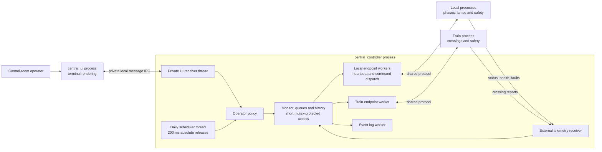

# Central Controller implementation note

## Scope and assignment coverage

Central is the control-room supervisor for the EEET2588 QNX traffic-light design project. It observes six logical intersections and three railway crossings, accepts operator requests, and distinguishes requested behavior from reported operation. This work is confined to `central_controller/`; shared protocol and Local/Train code remain under their teammates' ownership.

The supplied assignment requires safe continuous Local operation, railway protection, QNX IPC/synchronization, multiple QNX nodes and a separate display process. Its minimum functional network is I1-I2 plus railway protection; the full design extends that part to six intersections. Six Central dashboard rows do not establish six implemented Local state machines. Current Local/Train dependencies are documented in [INTEGRATION.md](INTEGRATION.md).

| Assignment concern | Central contribution | Evidence or remaining responsibility |
| --- | --- | --- |
| Control-room status and light settings | Per-intersection reports, gate/train state, faults, contact/health and data age. | Actual Local/Train telemetry required; missing fields stay unreported. |
| Select operating patterns | Fixed/sensor, temporary/revert, optional daily schedule and operator precedence. | Local validates, applies safely and owns timers. |
| Exceptional operator override | High-level mode/coordination through current shared messages. | No direct Central lamp writes or railway safety bypass. |
| Railway gate problems | Reported gate/fault display and simulator-event forwarding to Train. | Train independently enforces/reports its red signal and gates. |
| QNX IPC and synchronization | Named channels, message send/receive/reply, private display IPC, mutexes and condition variables. | Executed target evidence is in VALIDATION. |
| Separate display process | `central_ui` renders headless core snapshots and submits requests. | UI exit leaves the headless core running. |
| Multiple nodes and independent locals | Local/global transport and per-intersection service mapping. | Actual Local processes and GNS deployment require group integration evidence. |
| Design and demonstration | Task/message/sequence descriptions, assumptions and test references. | Group must add Local/Train state charts, map/timing assumptions and integrated results. |

Local-origin override requests and Central-to-Local display updates are extra shared declarations, not separately required flows in the supplied assignment. They remain unsupported until their contract is agreed. Central's separate display uses its own private interface.

## Source organization

| File | Responsibility |
| --- | --- |
| `src/central_controller.c` | Core state, queues/history, endpoint dispatch/probes, operator policy, event logging and snapshots. |
| `src/central_ui.c` | Separate terminal display, color, watch mode and one-shot requests. |
| `src/ui_ipc.c/.h` | Private same-node request/reply between core and display. |
| `src/ipc.c/.h` | Named-service transport, strict validation, compact normalization, reply checking and isolation of outstanding IPC. |
| `src/monitor.c/.h` | Observed state, contact, typed health, freshness and command readiness. |
| `src/commands.c/.h` | Local mode/coordination parser and command-ID/target helpers. |
| `src/operator_policy.c/.h` | Train allowlist, bounded daily-file parser and pure scheduling/precedence helpers. |
| `src/version.h` | Build label and compilation stamp. |
| `config/daily_schedule.example` | Optional daily pattern example; actual times need justification for the team's intersection. |
| `tests/` | Parser/policy, monitor, IPC, display and integration fixtures; executed coverage is in VALIDATION. |

Build/run instructions are in [README.md](README.md). The `version` label helps identify deployments but is not a negotiated wire version or binary identity. Record the source commit and target binary used for demonstration evidence.

## Task architecture



Each configured endpoint has a queue/dispatcher and lower-level ownership for an outstanding blocking operation. A slow Train cannot consume Local's queue or make the Local dispatcher wait for Train's reply. The telemetry receiver validates/copies state and replies; it does not wait for an operator or forward synchronously to a display.

The core copies snapshot data under its state mutex and formats outside that lock. In headless deployment, terminal writes occur in the UI process. Private UI requests/responses are bounded, have explicit error/truncation handling, and are separate from the shared peer ABI. The daily scheduler has its own timed thread, so waiting on terminal input does not drive schedule execution. The event logger has a bounded handoff and reports dropped records/write failure; filesystem backpressure can still delay logger shutdown.

## Operator sequence

```mermaid
sequenceDiagram
    actor Operator
    participant UI as Central UI process
    participant Core as Central core
    participant Worker as Local endpoint worker
    participant Local as Local controller
    Operator->>UI: mode-temp I1 sensor 30
    UI->>Core: Private command request
    Core->>Core: Validate syntax, readiness and capacity
    Core-->>UI: Queued ID, or request not queued
    Core->>Worker: Bounded queued request
    Worker->>Worker: Check heartbeat, TTL and fresh status
    Worker->>Local: MSG_MODE_COMMAND with ID
    alt Matching acceptance reply
        Local-->>Worker: reply_t status=0, matching ID
        Worker->>Core: Record ACCEPTED (receipt)
        Local->>Local: Apply at a safe transition
        Local->>Core: Actual MSG_STATUS_UPDATE
        Core-->>Local: Receipt reply
    else Rejected request
        Local-->>Worker: reply_t status=-1
        Worker->>Core: Record REJECTED
    else Missing or invalid reply
        Worker->>Core: Record UNCONFIRMED; no replay
    end
    UI->>Core: status / commands
    Core-->>UI: Reported operation and separate history
```

Version 1 status cannot identify the command that caused a change. Observing the requested mode later is useful but is not an APPLIED acknowledgement. Current Train additionally discards simulator result text and returns unconditional success; its receipt does not prove the event was accepted by the simulator.

History states are QUEUED, SENDING, ACCEPTED, REJECTED, UNCONFIRMED, CANCELED and EXPIRED. Cancellation/expiry before transmission means that queued request was not sent. Unconfirmed delivery is ambiguous and requires investigation before retrying. `all` expands to individually identified messages, allowing partial receipt.

## Timing assumptions and design decisions

The assignment supplies no numerical Central heartbeat, IPC, queue or freshness deadline. These values are supervisory assumptions, separate from Local safety timing.

| Mechanism | Configuration | Rationale and limit |
| --- | --- | --- |
| Peer probe | 1-second absolute monotonic releases. | Regular checks without catch-up bursts; in-flight work/scheduling may delay dispatch. |
| Link-down | 3 consecutive misses. | Tolerates a transient missed reply; not an exact three-second detection guarantee. |
| Peer caller wait | 500 ms. | Limits supervisory waiting under tested conditions; cannot force legacy kernel IPC to end. |
| Queue allowance | 5 seconds after dispatch eligibility. | Expires old unsent intent; an intentional `coordinate-at` delay precedes this allowance. |
| Status age | Default 5 seconds, `-s 1..60`. | Blocks requests based on stale state; proposed peer refresh is once per second, subject to agreement. |
| Command storage | 32 queued per endpoint; 64 retained history records. | Fixed storage and explicit overload; history is not a durable transaction journal. |
| Event storage | 64 queued; 8 recent display events. | Bounded log backpressure with dropped-record count. |
| UI watch | Approximately 1 second. | Human-facing refresh, not a safety feedback loop. |
| Daily schedule | Local wall clock, at most 32 rows. | Time-of-day pattern selection; timezone/clock changes can select another row. |
| Schedule evaluation | 200 ms absolute monotonic thread releases. | Independent of console I/O; evaluation/dispatch may still incur scheduling and queue delay. |
| Temporary holds/delayed dispatch | Monotonic elapsed time. | Unaffected by wall-clock changes; Local owns actual temporary-mode expiry. |

Timed condition variables explicitly use the monotonic clock instead of the default system clock. [QNX condition-variable clocks](https://qnx.com/developers/docs/7.1/com.qnx.doc.neutrino.lib_ref/topic/p/pthread_condattr_setclock.html).

QNX has distinct SEND-blocked and REPLY-blocked timeout states. A server using `_NTO_CHF_UNBLOCK` can receive an unblock pulse while the client remains blocked until the server finishes. Central retains outstanding-operation buffers and avoids automatic replay. A stopped legacy peer can still delay process termination. [QNX kernel message timeouts](https://qnx.com/developers/docs/7.1/com.qnx.doc.neutrino.getting_started/topic/s1_timer_Kernel_timeouts_with_messages.html).

Priority inheritance does not replace short critical sections, suitable priorities and workload analysis. This implementation does not claim measured WCET, a worst-case network bound or completed response-time analysis for the group's final workload. [QNX priority-inversion guidance](https://qnx.com/developers/docs/7.1/com.qnx.doc.ide.userguide/topic/detecting_priority_inversion.html).

Daily scheduling selects the latest applicable row per intersection, including previous-day wrap. Persistent operator intent holds automation. Temporary mode overlays it; `mode-revert` cancels only that layer. `schedule-resume` explicitly releases the hold. Uncertain operator outcomes conservatively suppress automation. Application priority fields are not QNX thread priorities or permission to override railway safety.

`coordinate-at` provides Central release timing only. The payload lacks a shared epoch and lateness contract, and sequential transmission produces differing arrivals. True corridor synchronization needs an agreed future protocol, clock-error bounds and end-to-end measurements.

## Current interoperability limits

The adapter supports original envelopes and exact compact telemetry structures. Current compact Train crossing-status/fault IDs are one-based; envelope crossing IDs stay zero-based. This is scoped compatibility, not negotiation. Native layout and absent session/status sequence/applied-command fields limit restart and replay detection.

Train reports aggregate train state, gate state and fault; separate tracks, flashing phase and train STOP remain unreported. Its blocking callbacks, shared simulator concurrency, unconditional ACK and crossing-to-intersection routing need owner review before an integrated real-time claim. The current remote `p#-fault` path re-locks an already-held Train mutex through a callback, so Central blocks that request with an explicit unsent outcome. Console fault injection and a stuck-gate simulation provide alternatives while the Train owner fixes the deadlock. Central-only changes cannot repair the underlying peer code.

Local must implement real phases, pedestrian/railway behavior, application receipts and status updates. Continued safe Local operation and temporary expiry with Central offline must be demonstrated using the actual Local process, not inferred from a Central fixture.

## Validation and demonstration

[VALIDATION.md](VALIDATION.md) records builds, target runs, observed timing and pending scenarios. Fixture results are separate from real-peer integration; single-node results are separate from GNS/multi-node results. Measurements from an older commit remain historical until changed binaries are validated.

Policy tests exercise Train allowlisting, malformed/duplicate schedule files, every daily minute boundary, manual/temporary precedence and monotonic overflow. Monitor/IPC tests address freshness, health ambiguity, malformed/truncated frames/replies, unavailable peers, timeouts and no replay. Integration must cover the real core, separate UI, routing, overload and command outcomes; claim only scenarios recorded as run.

Collect screenshots showing actual status, stale/offline state, gate fault and explicit clear, command outcomes and build version. Demonstrate UI exit while the headless core continues. Then demonstrate real Local operation/temp expiry with Central offline, both railway directions and affected intersection pairs, and integrated recovery on intended nodes. The group must add Local/Train state charts and measured timing rationale; this Central note does not replace those artifacts.
